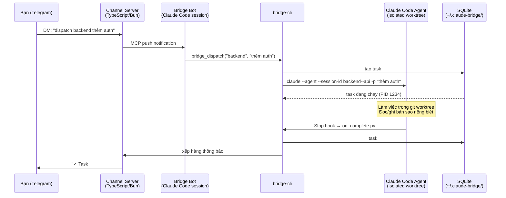

# Claude Bridge

🇬🇧 English: [README_en.md](README_en.md)

**Biến Claude Code thành đội ngũ AI làm việc 24/7 — điều khiển từ Telegram, không cần mở terminal.**

> Tạo nhiều agent, phân công dự án, dispatch task, theo dõi tiến độ — tất cả từ điện thoại.

[](https://github.com/hieutrtr/claude-bridge/releases)
[](tests/)
[](LICENSE)

---

## Tại sao cần Claude Bridge?

Claude Code rất mạnh — nhưng bị giam trong một session trên laptop. Claude Bridge phá vỡ giới hạn đó: tạo nhiều agent, mỗi agent phụ trách một dự án, điều phối tất cả từ điện thoại. Dispatch task, theo dõi chạy, duyệt kết quả, chạy vòng lặp tự động — không cần chạm vào terminal.

---

## Tính năng nổi bật

| | Tính năng | Mô tả |
|---|---------|-------------|
| 🤖 | **Điều phối đa agent** | Tạo và quản lý nhiều Claude Code agents từ Telegram |
| 🔄 | **Goal Loop** *(MỚI v0.3.0)* | Tự động lặp task đến khi đạt mục tiêu — command, file, LLM judge, hoặc duyệt thủ công |
| 📱 | **Telegram Control** | Dispatch, theo dõi, phê duyệt từ điện thoại — bất kỳ lúc nào, bất kỳ đâu |
| 🏗️ | **Worktree Isolation** | Mỗi task chạy trong git worktree riêng biệt, không xung đột |
| 🔌 | **MCP Native** | Tích hợp Claude Code qua Model Context Protocol — push thông báo, không polling |
| 🛡️ | **Bảo mật** | Bảo vệ bằng bot token, danh sách trắng người dùng, xác nhận trước khi chạy |
| 🐳 | **Daemon Mode** | Chạy như dịch vụ nền với systemd/launchd |
| 📊 | **Theo dõi chi phí** | Thống kê chi phí từng task và từng vòng lặp |

---

## Demo nhanh

**Dispatch task cho agent:**
```
/create backend ~/projects/my-api "Phát triển API"
dispatch backend thêm phân trang vào endpoint /users
# → Agent chạy trong worktree riêng → Telegram thông báo khi xong ✓
```

**Vòng lặp đến khi test pass (Goal Loop):**
```
loop backend sửa toàn bộ test thất bại cho đến khi pytest pass max 5
# → Dispatch → đánh giá → thử lại → thông báo kèm tóm tắt chi phí
```

**Đội nhóm đa agent:**
```
/create-team fullstack --lead backend --members frontend
/team-dispatch fullstack "xây dựng trang hồ sơ người dùng với API và UI"
# → agent backend + frontend phối hợp, bạn xem từng kết quả trên Telegram
```

---

## Cơ chế hoạt động

```
Bạn (Telegram)
  │
  ▼
Channel Server (TypeScript)        Polls Telegram qua grammy
  │                                Push message vào Claude session
  │ mcp.notification (push)        Retry nếu chưa ack trong 30s
  ▼
Claude Code session (Bridge Bot)   Message đến dưới dạng thẻ <channel>
  │                                CLAUDE.md xử lý intent
  │ bridge_dispatch(agent, prompt) reply(chat_id, text) gửi phản hồi
  ▼
claude --agent --worktree -p "task" Mỗi task = Claude Code agent riêng biệt
  │
  ▼
Stop hook → on_complete.py         Cập nhật SQLite, xếp hàng thông báo
                                   Channel server giao đến Telegram
```

## Bắt đầu nhanh

```bash
curl -fsSL https://raw.githubusercontent.com/hieutrtr/claude-bridge/main/install.sh | sh
```

Một lệnh duy nhất: kiểm tra prerequisites, tự động cài các dependency hệ thống còn thiếu (tmux, pipx, Bun), clone repo, build channel server, và cài `bridge-cli`. Sau đó chạy wizard thiết lập:

```bash
bridge-cli setup
```

Wizard sẽ hỏi bot token Telegram, tạo project bridge-bot, deploy channel server, và cài watcher cron. Hoàn tất trong dưới 2 phút.

> **Cài đặt thủ công** (nếu muốn từng bước): xem [Hướng dẫn cài đặt](#hướng-dẫn-cài-đặt) bên dưới.

## Yêu cầu hệ thống

| Thứ | Để làm gì |
|------|-----|
| Python 3.11+ | Core của Bridge |
| [Bun](https://bun.sh) | Runtime channel server |
| [Claude Code CLI](https://docs.anthropic.com/en/docs/claude-code) | Chạy `claude --version` để kiểm tra |
| Tài khoản Telegram | Bạn gửi lệnh từ điện thoại |

## Hướng dẫn cài đặt

### Bước 1: Clone và cài đặt

```bash
git clone https://github.com/hieutrtr/claude-bridge.git ~/projects/claude-bridge
cd ~/projects/claude-bridge

# Lựa chọn A: pipx (khuyến nghị — sạch sẽ, cô lập)
brew install pipx
pipx install -e .

# Lựa chọn B: pip với --break-system-packages (Homebrew Python)
pip3 install -e . --break-system-packages

# Lựa chọn C: venv
python3 -m venv ~/.claude-bridge/venv
~/.claude-bridge/venv/bin/pip install -e .
# Sau đó dùng: ~/.claude-bridge/venv/bin/bridge-cli (hoặc thêm vào PATH)
```

Lệnh `bridge-cli` sẽ có trong PATH sau bước này.

### Bước 2: Cài Bun và build

```bash
curl -fsSL https://bun.sh/install | bash
exec $SHELL
bun run build
```

Lệnh này đóng gói `channel/server.ts` thành một file JS duy nhất.

### Bước 3: Tạo Telegram bot

1. Mở Telegram, tìm [@BotFather](https://t.me/BotFather)
2. Gửi `/newbot`, làm theo hướng dẫn
3. Sao chép bot token

### Bước 4: Chạy wizard thiết lập

```bash
bridge-cli setup
```

Wizard sẽ:
1. Hỏi bot token → lưu vào `~/.claude-bridge/config.json`
2. Hỏi thư mục bridge-bot → tạo `CLAUDE.md` + `.mcp.json`
3. Deploy channel server vào `~/.claude-bridge/channel/dist/`
4. Cài watcher cron (chạy mỗi phút)
5. In ra lệnh khởi động

Hoặc không cần tương tác:
```bash
bridge-cli setup --token "<your-token>" --bot-dir ~/projects/bridge-bot --no-prompt
```

### Bước 5: Khởi động Bridge Bot

```bash
cd ~/projects/bridge-bot
claude --dangerously-load-development-channels server:bridge --dangerously-skip-permissions
```

### Bước 6: Ghép đôi tài khoản Telegram

Bước này liên kết Telegram user ID của bạn với Bridge Bot để chỉ bạn mới điều khiển được.

**Quy trình:**
1. Nhắn tin cho bot trên Telegram (bất kỳ tin gì — "hello" là ổn)
2. Channel server nhận tin và hiện **mã 6 chữ số** trong session Claude Code
3. Bạn nhập lệnh pair **ngay trong session Claude Code đó** (không phải terminal khác)
4. Bridge giới hạn truy cập chỉ với tài khoản Telegram của bạn

**Sơ đồ luồng:**
```
Điện thoại (Telegram)
  │  DM: "hello"
  ▼
Channel Server (đang chạy trong Claude Code session)
  │  in ra: "Pairing request from @yourhandle — code: 482931"
  ▼
Bạn gõ trong Claude Code session:
  /telegram:access pair 482931
  /telegram:access policy allowlist
  │
  ▼
Bridge phản hồi trên Telegram: "✅ Đã ghép đôi. Gửi /help để bắt đầu."
```

**Nơi chạy lệnh:**
Các lệnh `/telegram:access` được gõ **trực tiếp trong session Claude Code tương tác** — cùng cửa sổ terminal nơi bạn đã chạy:
```bash
claude --dangerously-load-development-channels server:bridge --dangerously-skip-permissions
```
Đây **không phải** `bridge-cli`, và **không phải** terminal khác. Chính Claude session đang đóng vai bot.

**Các bước chi tiết:**

1. Giữ nguyên Claude Code session từ Bước 5
2. Mở Telegram và nhắn tin cho bot (vd: "hello")
3. Theo dõi Claude Code session — sau vài giây sẽ thấy mã ghép đôi 6 chữ số
4. Trong session đó, gõ:
   ```
   /telegram:access pair <mã-6-chữ-số>
   ```
5. Sau đó giới hạn truy cập:
   ```
   /telegram:access policy allowlist
   ```
6. Telegram xác nhận: "✅ Đã ghép đôi và hạn chế truy cập."

**Xử lý sự cố:**

| Vấn đề | Nguyên nhân có thể | Cách khắc phục |
|---------|-------------|-----|
| Bot không trả lời DM | Token sai hoặc channel server chưa chạy | `bridge-cli doctor` — kiểm tra token và trạng thái server |
| Không thấy mã pair trong session | Channel server chưa khởi động | Xem lỗi trong output Claude session; chạy lại Bước 5 |
| Lỗi "Invalid code" | Mã hết hạn (timeout 30s) | Nhắn thêm tin trên Telegram để lấy mã mới |
| "Permission denied" sau khi pair | Chưa đặt policy allowlist | Chạy `/telegram:access policy allowlist` lại |
| Cần ghép đôi lại (điện thoại/tài khoản mới) | Pair cũ còn hiệu lực | Trong Claude session: `/telegram:access reset` rồi pair lại |

### Bước 7: Kiểm tra

```bash
bridge-cli doctor
```

Tất cả check phải pass. Gửi `/help` cho bot trên Telegram.

## Thiết lập đa người dùng (Multi-User Setup)

Claude Bridge hiện tại hỗ trợ **một người dùng mỗi instance**. Mỗi instance có Telegram bot, database và thư mục cấu hình riêng biệt.

Để hỗ trợ nhiều người dùng, chạy các instance riêng biệt với môi trường được cô lập:

### Yêu cầu cho mỗi instance

| Thứ | Lý do |
|------|-----|
| `CLAUDE_BRIDGE_HOME` riêng biệt | Cô lập cả hai SQLite database (`bridge.db`, `messages.db`) và `config.json` |
| Telegram bot token riêng biệt | Tránh Telegram poller offset race — nếu dùng chung, cả hai poller sẽ nhân đôi mỗi tin nhắn |
| Agent name hoặc project path riêng biệt | Tránh collision file agent `.md` và workspace path dưới `~/.claude/agents/` |
| Chỉ một watcher cron mỗi `CLAUDE_BRIDGE_HOME` | Tránh hoàn thành task kép và gửi thông báo Telegram trùng lặp |

### Ví dụ thiết lập

```bash
# Tạo bot cho mỗi người dùng qua @BotFather, sau đó:

# User Alice
CLAUDE_BRIDGE_HOME=~/.claude-bridge-alice \
  bridge-cli setup --token "token-alice" --bot-dir ~/projects/bridge-bot-alice --no-prompt

# User Bob
CLAUDE_BRIDGE_HOME=~/.claude-bridge-bob \
  bridge-cli setup --token "token-bob" --bot-dir ~/projects/bridge-bot-bob --no-prompt
```

Khởi động mỗi instance (tên tmux session tự động unique theo `CLAUDE_BRIDGE_HOME`):

```bash
# Instance cho Alice — tmux session: claude-bridge-{hash}
CLAUDE_BRIDGE_HOME=~/.claude-bridge-alice bridge start

# Instance cho Bob — tmux session: claude-bridge-{hash}
CLAUDE_BRIDGE_HOME=~/.claude-bridge-bob bridge start
```

Dừng/kiểm tra trạng thái:

```bash
CLAUDE_BRIDGE_HOME=~/.claude-bridge-alice bridge stop
CLAUDE_BRIDGE_HOME=~/.claude-bridge-alice bridge status
```

### Những gì vẫn dùng chung giữa các instance

Dù có `CLAUDE_BRIDGE_HOME` riêng biệt, những thứ sau vẫn dùng chung:

- **Stop hook routing** — nếu hai instance đăng ký agent trong **cùng một thư mục project**, lần `bridge-cli setup` thứ hai sẽ ghi đè Stop hook trong `.claude/settings.local.json`. Dùng project path riêng biệt để tránh.
- **File agent `.md`** — lưu tại `~/.claude/agents/bridge--{agent}--{project}.md`. Collision xảy ra nếu hai instance dùng cùng agent name và cùng project directory basename. Dùng agent name hoặc project path khác nhau.

### Hỗ trợ đa người dùng trên một bot (tương lai)

Dùng chung **một Telegram bot** cho nhiều người dùng cần Phase 2 (chưa triển khai). v0.4.0 đã thêm `chat_id` / `user_id` vào toàn bộ dispatch chain — infrastructure routing đã có, nhưng per-user agent isolation và access control cho shared bot chưa được implement.

---

## Cách dùng

### Tạo agent

Từ Telegram:
```
/create backend ~/projects/my-api "Phát triển API"
```

Hoặc ngôn ngữ tự nhiên:
```
tạo agent tên backend cho ~/projects/my-api, phụ trách phát triển API
```

### Dispatch task

```
dispatch backend thêm phân trang vào endpoint /users
```

Agent làm việc trong git worktree riêng biệt. Khi xong, bạn nhận thông báo Telegram.

### Kiểm tra trạng thái

```
/status              — tất cả task đang chạy
/agents              — danh sách tất cả agents
/history backend     — lịch sử task kèm chi phí
/kill backend        — dừng task đang chạy
```

### Đội nhóm agents

```
/create backend ~/projects/api "Phát triển API"
/create frontend ~/projects/web "React UI"
/create-team fullstack --lead backend --members frontend
/team-dispatch fullstack "xây dựng trang hồ sơ người dùng với API và UI"
```

### Goal Loop

Goal Loop dispatch task liên tục đến khi điều kiện hoàn thành được đáp ứng. Lý tưởng cho chu kỳ sửa lỗi, sinh code, và những việc cần nhiều lần thử.

#### Bắt đầu nhanh

```bash
# Sửa test — lặp đến khi pytest pass (tối đa 5 lần)
bridge-cli loop backend "Sửa toàn bộ test thất bại" \
    --done-when "command:pytest tests/" \
    --max 5

# Tạo báo cáo — lặp đến khi file tồn tại
bridge-cli loop vn-trader "Tạo bản tin thị trường buổi sáng" \
    --done-when "file_exists:output/morning-brief.md" \
    --max 3

# Tái cấu trúc — nhờ Claude đánh giá khi code sẵn sàng
bridge-cli loop backend "Tái cấu trúc module auth cho production" \
    --done-when "llm_judge:Code có test đầy đủ, xử lý lỗi và docs" \
    --max 8 --type bridge

# Human-in-the-loop — dừng chờ duyệt giữa các vòng lặp
bridge-cli loop backend "Viết API spec" \
    --done-when "manual:kiểm tra spec trước khi tiếp tục" \
    --max 5
```

#### Điều kiện hoàn thành

| Định dạng | Mô tả | Ví dụ |
|--------|-------------|---------|
| `command:CMD` | Chạy CMD, hoàn thành khi exit code 0 | `command:pytest tests/` |
| `file_exists:PATH` | Hoàn thành khi file tồn tại | `file_exists:output/report.md` |
| `file_contains:PATH:TEXT` | Hoàn thành khi file chứa text | `file_contains:result.txt:SUCCESS` |
| `llm_judge:RUBRIC` | Claude đánh giá theo tiêu chí | `llm_judge:Tất cả test pass và code có docs` |
| `manual[:MSG]` | Dừng chờ người duyệt sau mỗi vòng | `manual:kiểm tra trước khi tiếp tục` |

#### Loại vòng lặp

Bridge tự động chọn loại vòng lặp phù hợp:

- **Agent loop** — Bridge dispatch một task duy nhất, agent tự retry bên trong.
  Nhanh, không overhead. Dùng cho điều kiện `command`/`file_exists`/`file_contains`
  với `--max <= 5`.
- **Bridge loop** — Bridge dispatch một task mỗi vòng, đánh giá, và đưa phản hồi
  vào vòng tiếp theo. Quan sát được, theo dõi chi phí, có thông báo.
  Luôn dùng cho điều kiện `manual`/`llm_judge` hoặc `--max > 5`.

Ghi đè bằng `--type bridge|agent|auto` (mặc định: `bridge`).

#### Từ Telegram

Ngôn ngữ tự nhiên:
```
loop backend sửa test cho đến khi pytest pass
loop vn-trader tạo brief đến khi file output/brief.md tồn tại max 5
stop loop 42
loop status
approve
reject: test auth vẫn đang fail
```

#### Dashboard loop

```bash
bridge-cli loop-list             # tất cả loop gần đây
bridge-cli loop-list --active    # chỉ loop đang chạy
bridge-cli loop-list backend     # lọc theo agent
bridge-cli loop-history 42       # toàn bộ lịch sử vòng lặp #42
bridge-cli loop-status --loop-id 42
```

#### Quản lý loop

```bash
bridge-cli loop-cancel 42        # huỷ loop đang chạy
bridge-cli loop-approve 42       # duyệt loop với điều kiện manual
bridge-cli loop-reject 42 --feedback "test vẫn fail ở module X"
```

## Khởi động lại

```bash
cd ~/projects/bridge-bot
claude --dangerously-load-development-channels server:bridge --dangerously-skip-permissions
```

## Toàn bộ lệnh

### Lệnh Telegram

| Lệnh | Mô tả |
|---------|-------------|
| `/create <name> <path> "<purpose>"` | Đăng ký agent mới |
| `/delete <name>` | Xoá agent |
| `/agents` | Liệt kê tất cả agents |
| `/dispatch <agent> "<task>"` | Gửi task (xếp hàng nếu bận) |
| `/status [agent]` | Hiện task đang chạy |
| `/kill <agent>` | Dừng task đang chạy |
| `/history <agent>` | Lịch sử task kèm chi phí |
| `/queue [agent]` | Xem hàng đợi task |
| `/cancel <task_id>` | Huỷ task đang xếp hàng |
| `/set-model <agent> <model>` | Đổi model (sonnet/opus/haiku) |
| `/cost [agent]` | Tóm tắt chi phí |
| `/create-team <name> --lead <a> --members <b,c>` | Tạo đội nhóm |
| `/team-dispatch <team> "<task>"` | Dispatch đến đội nhóm |
| `/team-status <team>` | Tiến độ đội nhóm |

### Lệnh CLI

| Lệnh | Mô tả |
|---------|-------------|
| `bridge-cli setup` | Wizard thiết lập tương tác |
| `bridge-cli doctor` | Kiểm tra sức khoẻ cài đặt |
| `bridge-cli doctor --fix` | Tự động sửa các vấn đề |
| `bridge-cli uninstall` | Xoá data, config, cron |
| `bridge-cli setup-cron` | Cài watcher cron |
| `bridge-cli remove-cron` | Xoá watcher cron |
| `bridge-cli --version` | In version |

**Lệnh Loop:**

| Lệnh | Mô tả |
|---------|-------------|
| `bridge-cli loop <agent> <goal> --done-when <cond>` | Bắt đầu goal loop |
| `bridge-cli loop-list [agent] [--active] [--limit N]` | Liệt kê tất cả loops (dashboard) |
| `bridge-cli loop-history <loop-id>` | Lịch sử đầy đủ vòng lặp |
| `bridge-cli loop-status [agent] [--loop-id ID]` | Xem trạng thái loop |
| `bridge-cli loop-cancel <loop-id>` | Huỷ loop đang chạy |
| `bridge-cli loop-approve <loop-id>` | Duyệt loop điều kiện manual |
| `bridge-cli loop-reject <loop-id> [--feedback TEXT]` | Từ chối và tiếp tục loop |

## Kiến trúc

### Luồng hoạt động đầu cuối



### Bản đồ thành phần

```
~/.claude-bridge/
├── config.json        Bot token, cài đặt
├── bridge.db          SQLite: agents, tasks, teams
├── messages.db        SQLite: hàng đợi tin nhắn
├── channel/dist/      Channel server đã deploy
├── watcher.log        Output của cron
└── workspaces/        Kết quả task theo agent

~/projects/bridge-bot/
├── CLAUDE.md          Quy tắc routing của Bridge Bot
└── .mcp.json          Cấu hình channel server

~/.claude/agents/
└── bridge--*.md       Định nghĩa agents
```

Xem tài liệu kiến trúc chi tiết tại [specs/MVP.md](specs/MVP.md).

### Chi tiết kỹ thuật

| Thứ | Chi tiết |
|------|--------|
| Channel server | TypeScript/Bun, push qua `notifications/claude/channel` |
| Giao nhận tin | Push + retry 30s (tối đa 5 lần) |
| Hàng đợi thông báo | Ngăn stdio interleaving khi gọi tool |
| Stop hook | Trong `.claude/settings.local.json` của project (không phải frontmatter) |
| Session UUID | Unique mỗi task: `uuid5(session_id + task_id)` |
| Worktree | Mỗi task trong `git worktree` riêng biệt |
| Hàng đợi | Tự động xếp hàng khi bận, tự dequeue khi xong |

## Chạy từ source (không cần pipx)

Nếu không muốn cài package, chạy trực tiếp từ repo:

```bash
git clone https://github.com/hieutrtr/claude-bridge.git ~/projects/claude-bridge
cd ~/projects/claude-bridge

# Cài dependencies cho channel
cd channel && bun install && cd ..

# Chạy bất kỳ lệnh CLI nào với PYTHONPATH
PYTHONPATH=src python3 -m claude_bridge.cli setup
PYTHONPATH=src python3 -m claude_bridge.cli list-agents
PYTHONPATH=src python3 -m claude_bridge.cli dispatch backend "fix bug"

# Hoặc tạo alias
alias bridge-cli="PYTHONPATH=$(pwd)/src python3 -m claude_bridge.cli"
bridge-cli setup
```

`.mcp.json` được tạo bởi setup sẽ trỏ tới `channel/server.ts` (source) thay vì bundle `server.js`.

## Phát triển

```bash
# Cài cho phát triển
pip3 install -e . --break-system-packages   # hoặc: pipx install -e .

# Python tests (405+ test — bao gồm MCP tests)
python3 -m pytest tests/ -v

# TypeScript tests (43 test)
cd channel && bun test

# Build channel server bundle
bun run build

# Chạy bất kỳ lệnh CLI nào
bridge-cli <command>
```

## Xử lý sự cố

### Chẩn đoán nhanh

```bash
bridge-cli doctor        # kiểm tra tất cả thành phần
bridge-cli doctor --fix  # tự sửa những gì có thể
```

### Các vấn đề thường gặp

| Triệu chứng | Nguyên nhân có thể | Cách khắc phục |
|---------|-------------|-----|
| Bot không phản hồi DM Telegram | Token sai hoặc channel server chưa chạy | `bridge-cli doctor` — kiểm tra token và server; diệt zombie: `ps aux \| grep "bun.*server"` |
| Stop hook không kích hoạt | Python path sai (pipx install) | `bridge-cli doctor --fix` hoặc chạy lại `bridge-cli setup` |
| Task bị kẹt ở trạng thái "running" | Stop hook không bao giờ chạy (crash/reboot) | Watcher cron tự sửa trong vòng 1 phút; hoặc chạy `bridge-cli watcher` thủ công |
| Nhiều bot xung đột | Session bot cũ vẫn đang poll cùng token | Diệt cái cũ: `ps aux \| grep claude`, rồi `bridge start` |
| Thông báo kép | Bug reporting (đã sửa ở 0.2.0) | Nâng cấp: `pip install -U claude-agent-bridge` |
| `bun run build` thất bại | Phiên bản Node/bun không khớp | Kiểm tra: `bun --version` (cần ≥1.0); cài lại: `curl -fsSL https://bun.sh/install \| bash` |
| `bridge start` thất bại im lặng | Config thiếu hoặc bot_dir sai | Xem logs: `bridge logs`; chạy lại `bridge-cli setup` |
| Reset toàn bộ | State bị corrupt hoặc cần migration | `bridge-cli uninstall --force` rồi `bridge-cli setup` từ đầu |
| Stop hook không kích hoạt | Debug thông báo hoàn thành bị mất | Kiểm tra `~/.claude/logs/` hoặc thêm `echo "hook fired"` vào hook command |
| Bot không phản hồi sau pair | Policy chưa đặt thành allowlist | Trong Claude session: `/telegram:access policy allowlist` |
| Permission denied trên `bridge-cli` | Vấn đề PATH với pipx/pip install | `pipx ensurepath` rồi restart shell; hoặc dùng `~/.local/bin/bridge-cli` |
| `bridge-cli` không tìm thấy sau install | pipx không trong PATH | `export PATH="$HOME/.local/bin:$PATH"` — thêm vào `~/.bashrc` hoặc `~/.zshrc` |
| `ModuleNotFoundError: mcp` | Bản cài cũ thiếu dependency | `pip install -U "claude-agent-bridge[mcp]"` hoặc `pip install mcp>=1.0` |
| Agent task thất bại ngay lập tức | Claude CLI không trong PATH | `which claude` — nếu thiếu, cài lại Claude Code; `bridge-cli doctor` hiện lỗi chính xác |
| Lỗi worktree: đã tồn tại | Task trước crash giữa chừng | `git worktree prune` trong thư mục project |
