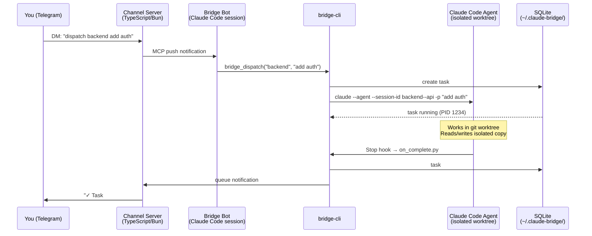

# Claude Bridge

🇻🇳 Tiếng Việt: [README.md](README.md)

**Turn Claude Code into a 24/7 AI team — controlled from Telegram, no terminal required.**

> Spawn multiple agents, assign projects, dispatch tasks, track progress — all from your phone.

[](https://github.com/hieutrtr/claude-bridge/releases)
[](tests/)
[](LICENSE)

---

## Why Claude Bridge?

Claude Code is powerful — but locked to a single session on your laptop. Claude Bridge breaks that wall: create multiple agents, each owning a project, and orchestrate all of them from your phone. Dispatch tasks, watch them run, approve results, and chain automated loops — without ever touching your terminal.

---

## Key Features

| | Feature | Description |
|---|---------|-------------|
| 🤖 | **Multi-Agent Dispatch** | Create and manage multiple Claude Code agents from Telegram |
| 🔄 | **Goal Loop** *(NEW v0.3.0)* | Auto-loop tasks until a goal is met — command check, file check, LLM judge, or manual approval |
| 📱 | **Telegram Control** | Dispatch, monitor, approve from your phone — anywhere, anytime |
| 🏗️ | **Worktree Isolation** | Each task runs in its own git worktree, zero conflict |
| 🔌 | **MCP Native** | Integrates with Claude Code via Model Context Protocol — push notifications, no polling |
| 🛡️ | **Security** | Bot token protection, user allowlist, action confirmation before execution |
| 🐳 | **Daemon Mode** | Run as a background service with systemd/launchd |
| 📊 | **Cost Tracking** | Track spending per task and per loop iteration |

---

## Quick Demo

**Dispatch a task to an agent:**
```
/create backend ~/projects/my-api "API development"
dispatch backend add pagination to /users endpoint
# → Agent runs in isolated worktree → Telegram notifies when done ✓
```

**Loop until tests pass (Goal Loop):**
```
loop backend fix all failing tests until pytest passes max 5
# → Dispatches → evaluates → retries → notifies with cost summary
```

**Multi-agent team:**
```
/create-team fullstack --lead backend --members frontend
/team-dispatch fullstack "build user profile page with API and UI"
# → backend + frontend agents coordinate, you see each result on Telegram
```

---

## How It Works

```
You (Telegram)
  │
  ▼
Channel Server (TypeScript)        Polls Telegram via grammy
  │                                Pushes messages into Claude session
  │ mcp.notification (push)        Retries if not acknowledged in 30s
  ▼
Claude Code session (Bridge Bot)   Messages arrive as <channel> tags
  │                                CLAUDE.md handles intent routing
  │ bridge_dispatch(agent, prompt) reply(chat_id, text) sends back
  ▼
claude --agent --worktree -p "task" Each task = isolated Claude Code agent
  │
  ▼
Stop hook → on_complete.py         Updates SQLite, queues notification
                                   Channel server delivers to Telegram
```

## Quick Start

```bash
curl -fsSL https://raw.githubusercontent.com/hieutrtr/claude-bridge/main/install.sh | sh
```

One command: checks prerequisites, auto-installs missing system dependencies (tmux, pipx, Bun), clones the repo, builds the channel server, and installs `bridge-cli`. Then run the setup wizard:

```bash
bridge-cli setup
```

The wizard asks for your Telegram bot token, creates the bridge-bot project, deploys the channel server, and installs the watcher cron. Done in under 2 minutes.

> **Manual install** (step-by-step): see [Installation](#installation) below.

## Prerequisites

| What | Why |
|------|-----|
| Python 3.11+ | Bridge core runtime |
| [Bun](https://bun.sh) | Channel server runtime |
| [Claude Code CLI](https://docs.anthropic.com/en/docs/claude-code) | Run `claude --version` to verify |
| Telegram account | You send commands from your phone |

## Installation

### Step 1: Clone and install

```bash
git clone https://github.com/hieutrtr/claude-bridge.git ~/projects/claude-bridge
cd ~/projects/claude-bridge

# Option A: pipx (recommended — isolated, clean)
brew install pipx
pipx install -e .

# Option B: pip with --break-system-packages (Homebrew Python)
pip3 install -e . --break-system-packages

# Option C: venv
python3 -m venv ~/.claude-bridge/venv
~/.claude-bridge/venv/bin/pip install -e .
# Then use: ~/.claude-bridge/venv/bin/bridge-cli (or add to PATH)
```

This gives you the `bridge-cli` command.

### Step 2: Install Bun and build

```bash
curl -fsSL https://bun.sh/install | bash
exec $SHELL
bun run build
```

This bundles `channel/server.ts` into a single JS file included in the package.

### Step 3: Create a Telegram bot

1. Open Telegram, search for [@BotFather](https://t.me/BotFather)
2. Send `/newbot`, follow the prompts
3. Copy the bot token

### Step 4: Run the setup wizard

```bash
bridge-cli setup
```

The wizard:
1. Asks for your bot token → saves to `~/.claude-bridge/config.json`
2. Asks for bridge-bot directory → creates `CLAUDE.md` + `.mcp.json`
3. Deploys the channel server to `~/.claude-bridge/channel/dist/`
4. Installs the watcher cron (runs every minute)
5. Prints the startup command

Non-interactive mode:
```bash
bridge-cli setup --token "<your-token>" --bot-dir ~/projects/bridge-bot --no-prompt
```

### Step 5: Start the Bridge Bot

```bash
cd ~/projects/bridge-bot
claude --dangerously-load-development-channels server:bridge --dangerously-skip-permissions
```

### Step 6: Pair your Telegram account

Pairing links your Telegram user ID to the Bridge Bot so only you can control it.

**What happens:**
1. You DM your bot on Telegram (send any message — "hello" works)
2. The channel server receives the message and shows a **6-digit pairing code** inside the Claude Code session
3. You enter the pair command **inside that Claude Code session** (not a separate terminal)
4. Bridge restricts access to your Telegram account only

**Flow diagram:**
```
Your phone (Telegram)
  │  DM: "hello"
  ▼
Channel Server (running in Claude Code session)
  │  prints: "Pairing request from @yourhandle — code: 482931"
  ▼
You type in the Claude Code session:
  /telegram:access pair 482931
  /telegram:access policy allowlist
  │
  ▼
Bridge responds to your Telegram: "✅ Paired. Send /help to get started."
```

**Where to run the commands:**
The `/telegram:access` commands are typed **directly in the Claude Code interactive session** — the same terminal window where you ran:
```bash
claude --dangerously-load-development-channels server:bridge --dangerously-skip-permissions
```
This is **not** `bridge-cli`, and **not** a separate terminal. It is the Claude session itself acting as the bot.

**Step-by-step:**

1. Keep the Claude Code session from Step 5 open
2. Open Telegram and send any message to your bot (e.g. "hello")
3. Watch the Claude Code session — within a few seconds you'll see a pairing prompt with a 6-digit code
4. In that same Claude session, type:
   ```
   /telegram:access pair <the-6-digit-code>
   ```
5. Then restrict access to your account only:
   ```
   /telegram:access policy allowlist
   ```
6. Telegram will confirm: "✅ Paired and access restricted."

**Troubleshooting:**

| Problem | Likely cause | Fix |
|---------|-------------|-----|
| Bot doesn't reply to your DM | Token wrong or channel server not running | `bridge-cli doctor` — check token and channel server status |
| No pairing prompt in Claude session | Channel server didn't start | Check for errors in Claude session output; re-run Step 5 |
| "Invalid code" error | Code expired (30s timeout) | Send another Telegram message to get a fresh code |
| "Permission denied" after pairing | Policy not set to allowlist | Run `/telegram:access policy allowlist` again |
| Need to re-pair (new phone/account) | Old pairing still active | In Claude session: `/telegram:access reset` then pair again |

### Step 7: Verify

```bash
bridge-cli doctor
```

All checks should pass. Send `/help` to your bot on Telegram.

## Multi-User Setup

Claude Bridge currently supports **one user per instance**. Each instance has its own Telegram bot, database, and configuration directory.

To support multiple users, run separate instances with isolated environments:

### Requirements per instance

| What | Why |
|------|-----|
| Separate `CLAUDE_BRIDGE_HOME` | Isolates both SQLite databases (`bridge.db`, `messages.db`) and `config.json` |
| Separate Telegram bot token | Eliminates the Telegram poller offset race — both pollers would otherwise duplicate every message |
| Separate agent names or project paths | Prevents agent `.md` file collision and workspace path collision under `~/.claude/agents/` |
| Only one watcher cron per `CLAUDE_BRIDGE_HOME` | Prevents double task completion and duplicate Telegram notifications |

### Setup example

```bash
# Create a bot for each user via @BotFather, then:

# User Alice
CLAUDE_BRIDGE_HOME=~/.claude-bridge-alice \
  bridge-cli setup --token "token-alice" --bot-dir ~/projects/bridge-bot-alice --no-prompt

# User Bob
CLAUDE_BRIDGE_HOME=~/.claude-bridge-bob \
  bridge-cli setup --token "token-bob" --bot-dir ~/projects/bridge-bot-bob --no-prompt
```

Start each instance in a separate terminal (or systemd unit / tmux window):

```bash
# Instance for Alice
CLAUDE_BRIDGE_HOME=~/.claude-bridge-alice \
  claude --dangerously-load-development-channels server:bridge --dangerously-skip-permissions

# Instance for Bob
CLAUDE_BRIDGE_HOME=~/.claude-bridge-bob \
  claude --dangerously-load-development-channels server:bridge --dangerously-skip-permissions
```

### What is still shared between instances

Even with separate `CLAUDE_BRIDGE_HOME`, the following remain shared:

- **Stop hook routing** — if two instances register agents in the **same project directory**, the second `bridge-cli setup` overwrites the Stop hook in `.claude/settings.local.json`. Use separate project paths to avoid this.
- **Agent `.md` files** — stored under `~/.claude/agents/bridge--{agent}--{project}.md`. Collision occurs if two instances use the same agent name and the same project directory basename. Use distinct agent names or project paths.

### Single-bot multi-user support (future)

Sharing a **single Telegram bot** between multiple users requires Phase 2 (not yet implemented). v0.4.0 added `chat_id` / `user_id` propagation through the dispatch chain — the routing infrastructure is in place, but per-user agent isolation and access control for a shared bot are not implemented yet.

---

## Usage

### Create an agent

From Telegram:
```
/create backend ~/projects/my-api "API development"
```

Or natural language:
```
set up an agent called backend for ~/projects/my-api, it handles API development
```

### Dispatch a task

```
dispatch backend add pagination to /users endpoint
```

The agent works in an isolated git worktree. When done, you get a Telegram notification.

### Check status

```
/status              — all running tasks
/agents              — list all agents
/history backend     — past tasks with cost
/kill backend        — stop a running task
```

### Agent teams

```
/create backend ~/projects/api "API development"
/create frontend ~/projects/web "React UI"
/create-team fullstack --lead backend --members frontend
/team-dispatch fullstack "build user profile page with API and UI"
```

### Goal Loop

Goal Loop dispatches tasks repeatedly until a done condition is met. Perfect for fix cycles, code generation, and anything that needs multiple attempts.

#### Quick start

```bash
# Fix tests — loop until pytest passes (max 5 attempts)
bridge-cli loop backend "Fix all failing tests" \
    --done-when "command:pytest tests/" \
    --max 5

# Generate report — loop until file exists
bridge-cli loop vn-trader "Generate morning market brief" \
    --done-when "file_exists:output/morning-brief.md" \
    --max 3

# Refactor — ask Claude to judge when code is ready
bridge-cli loop backend "Refactor auth module to be production-ready" \
    --done-when "llm_judge:Code has full test coverage, error handling, and docs" \
    --max 8 --type bridge

# Human-in-the-loop — pause for approval between iterations
bridge-cli loop backend "Write API spec" \
    --done-when "manual:review the spec before continuing" \
    --max 5
```

#### Done conditions

| Format | Description | Example |
|--------|-------------|---------|
| `command:CMD` | Run CMD, done when exit code 0 | `command:pytest tests/` |
| `file_exists:PATH` | Done when file exists | `file_exists:output/report.md` |
| `file_contains:PATH:TEXT` | Done when file contains text | `file_contains:result.txt:SUCCESS` |
| `llm_judge:RUBRIC` | Claude evaluates against rubric | `llm_judge:All tests pass and code is documented` |
| `manual[:MSG]` | Pause for human approval each iteration | `manual:review before continuing` |

#### Loop types

Bridge automatically selects the best loop type:

- **Agent loop** — Bridge dispatches a single task, the agent retries internally.
  Fast, no overhead. Used for `command`/`file_exists`/`file_contains` conditions
  with `--max <= 5`.
- **Bridge loop** — Bridge dispatches one task per iteration, evaluates, and sends
  feedback into the next iteration. Observable, cost-tracked, notification-supported.
  Always used for `manual`/`llm_judge` conditions or `--max > 5`.

Override with `--type bridge|agent|auto` (default: `bridge`).

#### From Telegram

Natural language:
```
loop backend fix tests until pytest passes
loop vn-trader generate brief until file output/brief.md exists max 5
stop loop 42
loop status
approve
reject: auth tests are still failing
```

#### Loop dashboard

```bash
bridge-cli loop-list             # all recent loops
bridge-cli loop-list --active    # only running loops
bridge-cli loop-list backend     # filtered by agent
bridge-cli loop-history 42       # full iteration history for loop #42
bridge-cli loop-status --loop-id 42
```

#### Loop management

```bash
bridge-cli loop-cancel 42        # cancel running loop
bridge-cli loop-approve 42       # approve a manual condition loop
bridge-cli loop-reject 42 --feedback "tests still failing in module X"
```

## Restarting

```bash
cd ~/projects/bridge-bot
claude --dangerously-load-development-channels server:bridge --dangerously-skip-permissions
```

## All Commands

### Telegram Commands

| Command | Description |
|---------|-------------|
| `/create <name> <path> "<purpose>"` | Register a new agent |
| `/delete <name>` | Remove an agent |
| `/agents` | List all agents |
| `/dispatch <agent> "<task>"` | Send a task (queues if busy) |
| `/status [agent]` | Show running tasks |
| `/kill <agent>` | Stop a running task |
| `/history <agent>` | Task history with cost |
| `/queue [agent]` | Show queued tasks |
| `/cancel <task_id>` | Cancel a queued task |
| `/set-model <agent> <model>` | Change model (sonnet/opus/haiku) |
| `/cost [agent]` | Cost summary |
| `/create-team <name> --lead <a> --members <b,c>` | Create team |
| `/team-dispatch <team> "<task>"` | Dispatch to team |
| `/team-status <team>` | Team progress |

### CLI Commands

| Command | Description |
|---------|-------------|
| `bridge-cli setup` | Interactive setup wizard |
| `bridge-cli doctor` | Check installation health |
| `bridge-cli doctor --fix` | Auto-repair issues |
| `bridge-cli uninstall` | Remove data, config, cron |
| `bridge-cli setup-cron` | Install watcher cron |
| `bridge-cli remove-cron` | Remove watcher cron |
| `bridge-cli --version` | Print version |

**Loop commands:**

| Command | Description |
|---------|-------------|
| `bridge-cli loop <agent> <goal> --done-when <cond>` | Start a goal loop |
| `bridge-cli loop-list [agent] [--active] [--limit N]` | List all loops (dashboard) |
| `bridge-cli loop-history <loop-id>` | Full iteration history for a loop |
| `bridge-cli loop-status [agent] [--loop-id ID]` | Show loop status |
| `bridge-cli loop-cancel <loop-id>` | Cancel a running loop |
| `bridge-cli loop-approve <loop-id>` | Approve a manual condition loop |
| `bridge-cli loop-reject <loop-id> [--feedback TEXT]` | Reject and continue loop |

## Architecture

### End-to-End Flow



### Component Map

```
~/.claude-bridge/
├── config.json        Bot token, settings
├── bridge.db          SQLite: agents, tasks, teams
├── messages.db        SQLite: message queue
├── channel/dist/      Deployed channel server
├── watcher.log        Cron output
└── workspaces/        Per-agent task results

~/projects/bridge-bot/
├── CLAUDE.md          Bridge Bot routing rules
└── .mcp.json          Channel server config

~/.claude/agents/
└── bridge--*.md       Agent definitions
```

For detailed architecture documentation see [specs/MVP.md](specs/MVP.md).

### Key Details

| What | Detail |
|------|--------|
| Channel server | TypeScript/Bun, push via `notifications/claude/channel` |
| Message delivery | Push + 30s retry (5 retries max) |
| Notification queue | Prevents stdio interleaving during tool calls |
| Stop hook | In project's `.claude/settings.local.json` (not frontmatter) |
| Session UUID | Unique per task: `uuid5(session_id + task_id)` |
| Worktree | Each task in isolated `git worktree` |
| Queue | Auto-queue when busy, auto-dequeue on completion |

## Run from Source (without pipx)

If you prefer to run directly from the repo without installing the package:

```bash
git clone https://github.com/hieutrtr/claude-bridge.git ~/projects/claude-bridge
cd ~/projects/claude-bridge

# Install channel dependencies
cd channel && bun install && cd ..

# Run any CLI command with PYTHONPATH
PYTHONPATH=src python3 -m claude_bridge.cli setup
PYTHONPATH=src python3 -m claude_bridge.cli list-agents
PYTHONPATH=src python3 -m claude_bridge.cli dispatch backend "fix bug"

# Or create an alias
alias bridge-cli="PYTHONPATH=$(pwd)/src python3 -m claude_bridge.cli"
bridge-cli setup
```

The `.mcp.json` generated by setup will point to `channel/server.ts` (source) instead of the bundled `server.js`.

## Development

```bash
# Install for development
pip3 install -e . --break-system-packages   # or: pipx install -e .

# Python tests (405+ tests — including MCP tests)
python3 -m pytest tests/ -v

# TypeScript tests (43 tests)
cd channel && bun test

# Build channel server bundle
bun run build

# Run any CLI command
bridge-cli <command>
```

## Troubleshooting

### Quick diagnostics

```bash
bridge-cli doctor        # check all components
bridge-cli doctor --fix  # auto-repair what can be fixed
```

### Common problems

| Symptom | Likely cause | Fix |
|---------|-------------|-----|
| Bot doesn't respond to Telegram DMs | Token wrong or channel server not running | `bridge-cli doctor` — check token and server; kill zombie: `ps aux \| grep "bun.*server"` |
| Stop hook not firing | Python path wrong (pipx install) | `bridge-cli doctor --fix` or re-run `bridge-cli setup` |
| Task stuck as "running" | Stop hook never fired (crash/reboot) | Watcher cron auto-fixes within 1 minute; or run `bridge-cli watcher` manually |
| Multiple bots conflict | Old bot session still polling same token | Kill old: `ps aux \| grep claude`, then `bridge start` |
| Double notifications | Reporting bug (fixed in 0.2.0) | Upgrade: `pip install -U claude-agent-bridge` |
| `bun run build` fails | Node/bun version mismatch | Check: `bun --version` (need ≥1.0); reinstall: `curl -fsSL https://bun.sh/install \| bash` |
| `bridge start` fails silently | Config missing or bot_dir wrong | Check logs: `bridge logs`; re-run `bridge-cli setup` |
| How to reset everything | Corrupted state or migration needed | `bridge-cli uninstall --force` then `bridge-cli setup` from scratch |
| Stop hook not firing | Debug a missing completion notification | Check `~/.claude/logs/` or add `echo "hook fired"` to hook command |
| Bot not responding after pairing | Policy not set to allowlist | In Claude session: `/telegram:access policy allowlist` |
| Permission denied on `bridge-cli` | PATH issue with pipx/pip install | `pipx ensurepath` then restart shell; or use `~/.local/bin/bridge-cli` |
| `bridge-cli` not found after install | pipx not in PATH | `export PATH="$HOME/.local/bin:$PATH"` — add to `~/.bashrc` or `~/.zshrc` |
| `ModuleNotFoundError: mcp` | Old install missing dependency | `pip install -U "claude-agent-bridge[mcp]"` or `pip install mcp>=1.0` |
| Agent tasks fail immediately | Claude CLI not in PATH | `which claude` — if missing, reinstall Claude Code; `bridge-cli doctor` shows exact error |
| Worktree error: already exists | Previous task crashed mid-run | `git worktree prune` in the project directory |
